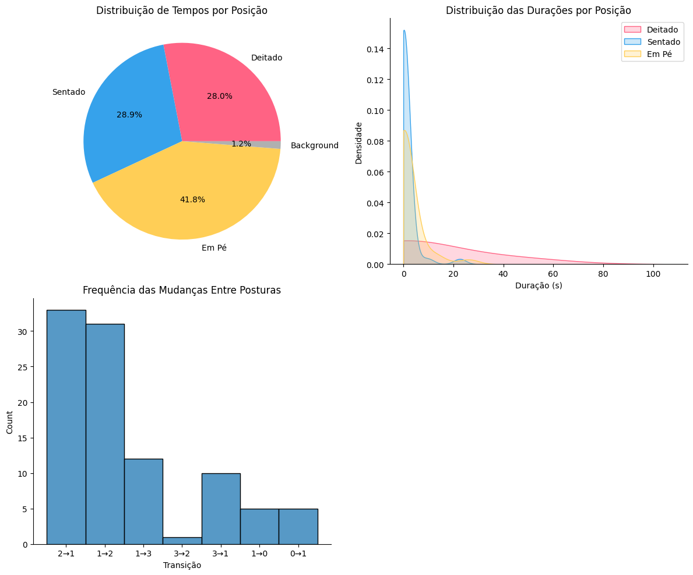

# 📌 Projeto de Detecção de Posturas com YOLO

Este projeto utiliza **YOLO** para identificar e analisar posturas humanas em imagens e vídeos, gerando relatórios e gráficos detalhados sobre os tempos de cada posição.

## 🚀 Funcionalidades
- Detecta **posturas humanas**: Deitado, Sentado e Em Pé.
- Processa **imagens e vídeos**.
- Gera relatórios detalhados de **tempo em cada posição**.
- Cria **gráficos de análise** (pizza, histograma, distribuição).
- Adiciona **áudio original** ao vídeo processado.

## 📂 Estrutura do Projeto
```
/
|-- visao.ipynb             # Código principal
|-- best.pt             # Arquivo do modelo YOLO
|-- README.md               # Este arquivo
```

## 🛠️ Requisitos
- Python 3.x
- OpenCV
- Matplotlib
- Seaborn
- MoviePy
- YOLO (Ultralytics)

### 📦 Instalação das Dependências
```bash
pip install ultralytics
```

## 🖥️ Como Usar

### Carregar os Pesos

```python
# Carrega o modelo YOLO previamente treinado usando o arquivo de pesos "best.pt"
modelo = YOLO('/content/best.pt')
```

### 🔹 Processar um vídeo:
```python
# Aplica o modelo ao vídeo "teste.mp4" para detectar posturas
# O resultado será salvo e processado automaticamente pela função "processar_midia"
processar_midia('/content/teste.mp4', modelo, tipo='video')
```

### 🔹 Processar uma imagem:
```python
processar_midia('exemplos/imagem.jpg', modelo, tipo='imagem')
```

## 📊 Exemplos de Saída
### 📌 Relatório de Tempo
| Categoria    | Tempo (s) | Porcentagem |
|-------------|----------|------------|
| **Deitado** | 44.93    | 28.05% |
| **Sentado** | 46.31    | 28.91% |
| **Em Pé**  | 66.97    | 41.80% |
| **Total**   | 160.21   | 100% |

### 📊 Gráfico Gerado


---

