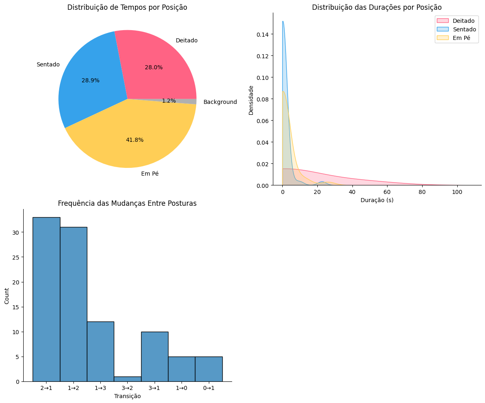

# Introdução

Este mini livro descreve em detalhes a lógica e a implementação de um algoritmo para detecção de posturas (deitado, sentado, em pé, background) utilizando o modelo YOLO (You Only Look Once). Vamos explorar cada linha de código, explicando sua função e a lógica por trás dela.

---

# Importação de Bibliotecas e Ambiente

## Configuração Inicial no Google Colab

Este projeto foi desenvolvido para ser executado no **Google Colab**. Para garantir que tudo funcione corretamente, siga os passos abaixo:

1. **Instalar a biblioteca YOLO**

```python
# Instala a biblioteca ultralytics para uso do modelo YOLO
# !pip install ultralytics
```

2. **Importar o arquivo de pesos**

Certifique-se de que o arquivo de pesos `best.pt` (modelo previamente treinado) esteja carregado no Colab.

## Importação das Bibliotecas

```python
import cv2  # OpenCV para manipulação de imagens e vídeos
import time  # Medição de tempo e pausas na execução do código
import os  # Manipulação de arquivos e diretórios
import warnings  # Ignora avisos desnecessários
import matplotlib.pyplot as plt  # Geração de gráficos
import seaborn as sns  # Visualizações estatísticas avançadas
from IPython.display import display, Markdown  # Exibição de Markdown em notebooks
from google.colab import files  # Upload e download de arquivos no Google Colab
warnings.filterwarnings("ignore", category=UserWarning, module="moviepy")
```

### Explicação
- **cv2**: manipula vídeos e imagens, permitindo leitura, escrita, e anotações visuais.
- **time**: mede durações, essencial para capturar tempos das posturas.
- **os**: gerencia arquivos e diretórios.
- **warnings**: suprime mensagens desnecessárias para manter o console limpo.
- **matplotlib**: cria gráficos, como os gráficos de pizza.
- **seaborn**: facilita gráficos estatísticos.
- **IPython.display**: exibe textos formatados em Markdown.
- **google.colab**: manipula arquivos diretamente no Google Colab.

---

# Função principal: `processar_midia`

## Estrutura e Lógica Geral

A função `processar_midia` é responsável por processar imagens ou vídeos, aplicar o modelo YOLO para detecção de posturas e gerar relatórios sobre o tempo gasto em cada postura. Vamos destrinchar cada parte dela.

```python
def processar_midia(caminho_entrada, modelo, tipo='video', caminho_saida='/content/saida.mp4'):
    if tipo not in ['imagem', 'video']:
        raise ValueError("Tipo deve ser 'imagem' ou 'video'.")
```

### Explicação
- **caminho_entrada**: Caminho para o arquivo de entrada (imagem ou vídeo).
- **modelo**: O modelo YOLO previamente treinado que será usado para detectar posturas.
- **tipo**: Define se o arquivo de entrada é uma imagem ou um vídeo. Caso não seja nem 'imagem' nem 'video', a função lança um erro com o `raise ValueError()`.
- **caminho_saida**: Caminho para onde o arquivo processado (com as anotações visuais) será salvo.

---

## Inicializando Contadores

Os contadores serão usados para medir o tempo que a pessoa passa em cada postura ao longo do vídeo.

```python
    tempo_deitado = 0
    tempo_sentado = 0
    tempo_em_pe = 0
    tempo_background = 0
    tempo_total = 0

    posturas_tempo = []
    transicoes = []
    duracoes_posturas = {0: [], 1: [], 2: [], 3: []}  # 0: Deitado, 1: Sentado, 2: Em Pé, 3: Background
    inicio_execucao = time.time()
```

### Explicação
- **tempo_deitado**: Conta quantos frames mostram a pessoa deitada.
- **tempo_sentado**: Conta quantos frames mostram a pessoa sentada.
- **tempo_em_pe**: Conta quantos frames mostram a pessoa em pé.
- **tempo_background**: Conta quantos frames sem nenhuma detecção relevante (background).
- **tempo_total**: Número total de frames processados.
- **posturas_tempo**: Lista que registra a postura detectada em cada frame, útil para análises posteriores.
- **transicoes**: Lista de transições entre posturas, usada para entender mudanças ao longo do vídeo.
- **duracoes_posturas**: Um dicionário que armazena a duração de cada postura em segundos.
- **inicio_execucao**: Marca o tempo de início da execução, para depois calcular o tempo total gasto no processamento.

---

## Processamento de Imagem

Caso o tipo de mídia seja 'imagem', o código processa a imagem individualmente.

```python
    if tipo == 'imagem':
        img = cv2.imread(caminho_entrada)
        results = modelo.predict(img, conf=0.1, verbose=False)
        annotated_img = results[0].plot()
        cv2.imwrite(caminho_saida, annotated_img)
        return caminho_saida
```

### Explicação
- **cv2.imread(caminho_entrada)**: Lê a imagem localizada no caminho especificado.
- **modelo.predict(img, conf=0.1, verbose=False)**: Aplica o modelo YOLO para detectar posturas na imagem.
  - `conf=0.1`: Define a confiança mínima (10%) para considerar uma detecção válida.
  - `verbose=False`: Desativa saídas excessivas no console.
- **results[0].plot()**: Desenha as caixas delimitadoras (bounding boxes) ao redor das posturas detectadas.
- **cv2.imwrite(caminho_saida, annotated_img)**: Salva a imagem anotada no caminho especificado.
- **return caminho_saida**: Retorna o caminho do arquivo gerado.

---

## Processamento de Vídeo

Agora, vamos ver como o código processa vídeos frame a frame.

```python
    else:
        cap = cv2.VideoCapture(caminho_entrada)
        width = int(cap.get(cv2.CAP_PROP_FRAME_WIDTH))
        height = int(cap.get(cv2.CAP_PROP_FRAME_HEIGHT))
        fps = int(cap.get(cv2.CAP_PROP_FPS))
        total_frames = int(cap.get(cv2.CAP_PROP_FRAME_COUNT))
```

### Explicação
- **cv2.VideoCapture(caminho_entrada)**: Carrega o vídeo no caminho especificado.
- **cap.get(cv2.CAP_PROP_FRAME_WIDTH)**: Obtém a largura dos frames do vídeo.
- **cap.get(cv2.CAP_PROP_FRAME_HEIGHT)**: Obtém a altura dos frames.
- **cap.get(cv2.CAP_PROP_FPS)**: Recupera o número de quadros por segundo (FPS), essencial para converter frames em segundos.
- **cap.get(cv2.CAP_PROP_FRAME_COUNT)**: Conta o número total de frames no vídeo.


## Definição do Codec e Criação do Objeto de Escrita de Vídeo

```python
# Define o codec de vídeo e cria um objeto para salvar o vídeo processado 
fourcc = cv2.VideoWriter_fourcc(*'XVID')
out = cv2.VideoWriter(caminho_saida, fourcc, fps, (width, height))
```

### Explicação
- **fourcc**: Define o codec usado para compressão do vídeo. 
  - `*'XVID'`: Codec Xvid, amplamente suportado e eficiente.
- **cv2.VideoWriter**: Cria um objeto para salvar o vídeo processado.
  - **caminho_saida**: Caminho do arquivo de saída.
  - **fourcc**: Codec para compressão.
  - **fps**: Frames por segundo.
  - **(width, height)**: Dimensões do vídeo.

---

## Controle de Transições

```python
# Inicializa variáveis para rastrear transições entre posturas
postura_anterior = None
duracao_atual = 0
```

### Explicação
- **postura_anterior**: Armazena a postura do frame anterior para comparação.
- **duracao_atual**: Conta quantos frames a postura atual perdura.

---

## Loop de Processamento de Frames

```python
# Loop para processar cada quadro do vídeo
while cap.isOpened():
    ret, frame = cap.read()  # Lê um quadro do vídeo
    if not ret:
        break  # Encerra o loop quando não há mais quadros
```

### Explicação
- **cap.isOpened()**: Verifica se o vídeo foi aberto corretamente.
- **cap.read()**: Lê o próximo frame.
- **ret**: Retorna `False` quando os quadros terminam.
- **break**: Encerra o loop ao final do vídeo.

---

## Aplicação do Modelo YOLO

```python
    # Aplica o modelo ao quadro e obtém os resultados
    results = modelo.predict(frame, conf=0.1, verbose=False)
    annotated_frame = results[0].plot()  # Adiciona anotações ao quadro
    out.write(annotated_frame)  # Salva o quadro anotado
```

### Explicação
- **modelo.predict()**: Aplica YOLO ao frame.
  - **frame**: Quadro atual.
  - **conf=0.1**: Confiança mínima de 10% para detectar posturas.
  - **verbose=False**: Desativa saídas no console.
- **results[0].plot()**: Desenha as caixas delimitadoras (bounding boxes).
- **out.write()**: Grava o quadro anotado no vídeo de saída.

---

## Classificação das Posturas

```python
    frame_classificado = False
    class_id = 3  # Background padrão

    for result in results:
        for box in result.boxes:
            class_id = int(box.cls)
            frame_classificado = True
            break
```

### Explicação
- **frame_classificado**: Marca se houve alguma detecção.
- **class_id = 3**: Assume que o frame é background por padrão.
- **for result in results**: Itera sobre os resultados.
- **int(box.cls)**: Obtém a classe detectada.
- **break**: Para após a primeira detecção válida.

---

## Contagem de Posturas

```python
    if not frame_classificado:
        tempo_background += 1
    else:
        if class_id == 0:
            tempo_deitado += 1
        elif class_id == 1:
            tempo_sentado += 1
        elif class_id == 2:
            tempo_em_pe += 1
```

### Explicação
- Atualiza os contadores de tempo para cada postura.
- **tempo_background**: Incrementado caso nenhuma postura seja detectada.
- **class_id == 0**: Postura deitado.
- **class_id == 1**: Postura sentado.
- **class_id == 2**: Postura em pé.

---

## Controle de Transições

```python
    if postura_anterior is None:
        postura_anterior = class_id
        duracao_atual = 1
    elif postura_anterior == class_id:
        duracao_atual += 1
    else:
        duracoes_posturas[postura_anterior].append(duracao_atual / fps)
        transicoes.append((postura_anterior, class_id))
        postura_anterior = class_id
        duracao_atual = 1
```

### Explicação
- **postura_anterior**: Guarda a última postura detectada.
- **duracao_atual**: Incrementa enquanto a postura não muda.
- **duracoes_posturas**: Armazena a duração de cada postura em segundos.
- **transicoes**: Registra mudanças de postura.

---

## Finalizando o Processo

```python
    tempo_total += 1
    posturas_tempo.append(class_id)

cap.release()
out.release()
```

### Explicação
- **tempo_total**: Contagem total de frames.
- **posturas_tempo**: Lista com a sequência de posturas.
- **cap.release()**: Fecha o vídeo de entrada.
- **out.release()**: Finaliza e salva o vídeo anotado.


---

## Registro do Tempo de Execução

```python
# Registra o tempo de execução
tempo_execucao = fim_execucao - inicio_execucao
```

### Explicação
- **fim_execucao**: Marca o momento em que o processamento do vídeo é concluído.
- **inicio_execucao**: Foi definido antes do loop de processamento.
- **tempo_execucao**: Subtraindo um pelo outro, obtemos o tempo total gasto para processar o vídeo.

---

## Geração do Relatório de Posturas

```python
# Exibir relatório de tempo em formato Markdown
relatorio_tabela = f"""
# 📊 Relatório de Tempo (em Segundos)

| Categoria      | Tempo (s) | Porcentagem |
|---------------|----------|------------|
| **Deitado**   | {tempo_deitado / fps:.2f}  | {(tempo_deitado / tempo_total) * 100:.2f}% |
| **Sentado**   | {tempo_sentado / fps:.2f}  | {(tempo_sentado / tempo_total) * 100:.2f}% |
| **Em Pé**     | {tempo_em_pe / fps:.2f}    | {(tempo_em_pe / tempo_total) * 100:.2f}% |
| **Background** | {tempo_background / fps:.2f}  | {(tempo_background / tempo_total) * 100:.2f}% |
| **Duração do Vídeo**  | {total_frames / fps:.2f}  | 100% |
| **Tempo de Processamento** | {tempo_execucao:.2f} | - |
"""
display(Markdown(relatorio_tabela))
```

### Explicação
- **relatorio_tabela**: Usa uma string formatada para criar um relatório em Markdown.
- **tempo_deitado / fps**: Converte frames em segundos.
- **(tempo_deitado / tempo_total) * 100**: Calcula a porcentagem de tempo gasto em cada postura.
- **display(Markdown(...))**: Exibe o relatório no formato elegante de Markdown.

---

## Visualizações Gráficas

### Gráfico de Pizza: Distribuição de Posturas

```python
# Gráfico de pizza para distribuição de tempo por postura
labels = ['Deitado', 'Sentado', 'Em Pé', 'Background']
tempos = [tempo_deitado, tempo_sentado, tempo_em_pe, tempo_background]
colors = ['#FF6384', '#36A2EB', '#FFCE56', '#B0B0B0']

fig, axes = plt.subplots(2, 2, figsize=(12, 10))
axes[0, 0].pie(tempos, labels=labels, autopct='%1.1f%%', colors=colors)
axes[0, 0].set_title('Distribuição de Tempos por Posição')
```

### Explicação
- **labels**: Nomes das posturas.
- **tempos**: Lista de tempos acumulados em cada postura.
- **colors**: Cores atribuídas a cada postura.
- **plt.pie**: Cria o gráfico de pizza.
- **autopct='%1.1f%%'**: Exibe as porcentagens diretamente no gráfico.

---

### Gráfico KDE: Duração das Posturas

```python
# Gráfico KDE para distribuição de durações por postura
for class_id, label, color in zip([0, 1, 2], ['Deitado', 'Sentado', 'Em Pé'], ['#FF6384', '#36A2EB', '#FFCE56']):
    if duracoes_posturas[class_id]:
        sns.kdeplot(duracoes_posturas[class_id], ax=axes[0, 1], fill=True, color=color, label=label, bw_adjust=1.5, clip=(0, None))

axes[0, 1].set_title('Distribuição das Durações por Posição')
axes[0, 1].set_xlabel('Duração (s)')
axes[0, 1].set_ylabel('Densidade')
axes[0, 1].legend()
sns.despine(ax=axes[0, 1])
```

### Explicação
- **zip()**: Itera sobre as classes, rótulos e cores simultaneamente.
- **sns.kdeplot**: Cria gráficos de densidade (KDE) para exibir a distribuição das durações.
- **bw_adjust=1.5**: Ajusta a suavidade das curvas.

---

### Histograma: Transições entre Posturas

```python
# Histograma de mudanças de postura
transicoes_numericas = [f'{t[0]}→{t[1]}' for t in transicoes]
sns.histplot(transicoes_numericas, ax=axes[1, 0])
axes[1, 0].set_title('Frequência das Mudanças Entre Posturas')
axes[1, 0].set_xlabel('Transição')
sns.despine(ax=axes[1, 0])
```

### Explicação
- **transicoes_numericas**: Transforma transições de posturas em strings formatadas.
- **sns.histplot**: Plota um histograma da frequência das transições.
- **set_title()**: Define o título do gráfico.
- **set_xlabel()**: Adiciona rótulo ao eixo X.

---

## Exibição Final dos Gráficos

```python
# Ajuste final da visualização
tplt.delaxes(axes[1, 1])  # Remove espaço vazio
plt.tight_layout()
plt.show()
```

### Explicação
- **plt.delaxes()**: Remove um gráfico vazio para manter o layout limpo.
- **plt.tight_layout()**: Garante que os gráficos não fiquem sobrepostos.
- **plt.show()**: Renderiza os gráficos.

---

Com isso, concluímos a análise visual e estatística das posturas detectadas. Podemos agora avançar para interpretar esses resultados e entender como eles podem informar decisões práticas! 🚀

--- 

# Exemplo de Aplicação do Modelo

```python
# Carrega o modelo YOLO previamente treinado usando o arquivo de pesos "best.pt"
modelo = YOLO('/content/best.pt')

# Aplica o modelo ao vídeo "teste.mp4" para detectar posturas
# O resultado será salvo e processado automaticamente pela função "processar_midia"
processar_midia('/content/teste_2.mp4', modelo, tipo='video')
```

_Exemplo de output:_



---

Com isso, concluímos a análise visual e estatística das posturas detectadas. Essencialmente, a transição do modelo de classificação para a EDA transforma simples etiquetas ("Deitado", "Sentado") em uma narrativa estatística sobre o comportamento ao longo do tempo.
